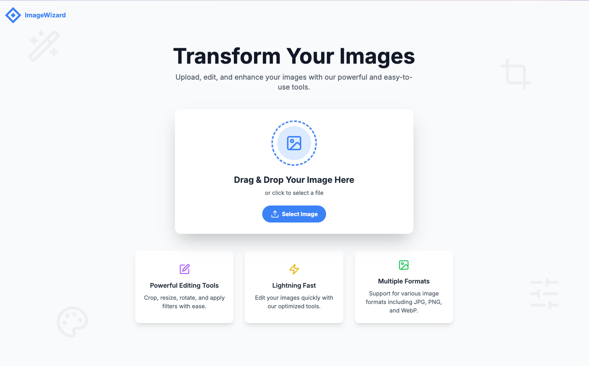

# 📸 ImageWizard

An interactive image editing component built with React, Lucide icons, and custom utilities. This tool allows users to crop, resize, rotate, flip, adjust settings, apply filters, and add text to images. Users can load an image from local storage, edit it, and save it in different formats with customizable quality.



## ✨ Features

- **✂️ Crop:** Crop images to fixed aspect ratios like 1:1, 4:3, and 16:9.
- **📏 Resize:** Resize images by width, height, or custom dimensions.
- **🔄 Rotate:** Rotate images by 90° left or right or rotate to any angle.
- **🔄 Flip:** Flip images horizontally or vertically.
- **🌞 Adjust:** Adjust brightness, contrast, and saturation.
- **🎨 Filters:** Apply filters like grayscale, sepia, invert, and more.
- **📝 Text:** Add custom text with adjustable alignment and color.
- **💾 Save Options:** Download edited images in JPG, PNG, or WebP formats with adjustable quality.

## 🚀 Installation

1. Clone this repository:

   ```bash
   git clone https://github.com/your-username/ImageWizard.git
   ```

2. Navigate to the project directory:

   ```bash
   cd ImageWizard
   ```

3. Install the dependencies:
   ```bash
   npm install
   ```

## 🛠️ Usage

1. Run the app locally:

   ```bash
   npm run dev
   ```

2. Open the app in your browser at http://localhost:3000.

## 🎨 Customization

You can customize the component's styles and icons by modifying the relevant Tailwind CSS classes and Lucide icons used in the component.

## 🤝 Contributing

1. Fork the repository.
2. Create your feature branch: `git checkout -b feature/YourFeature`
3. Commit your changes: `git commit -m 'Add some feature'`
4. Push to the branch: `git push origin feature/YourFeature`
5. Open a pull request.

## 📜 License

This project is licensed under the MIT License.

## 📬 Contact

For further queries, feel free to reach out:

- **X:** [@ichiranjeeb](https://x.com/ichiranjeeb)
- **Email:** [work.chiranjeeb@gmail.com](mailto:work.chiranjeeb@gmail.com)

Project: [https://github.com/chiranjeebhub/image-wizard](https://github.com/chiranjeebhub/image-wizard)
